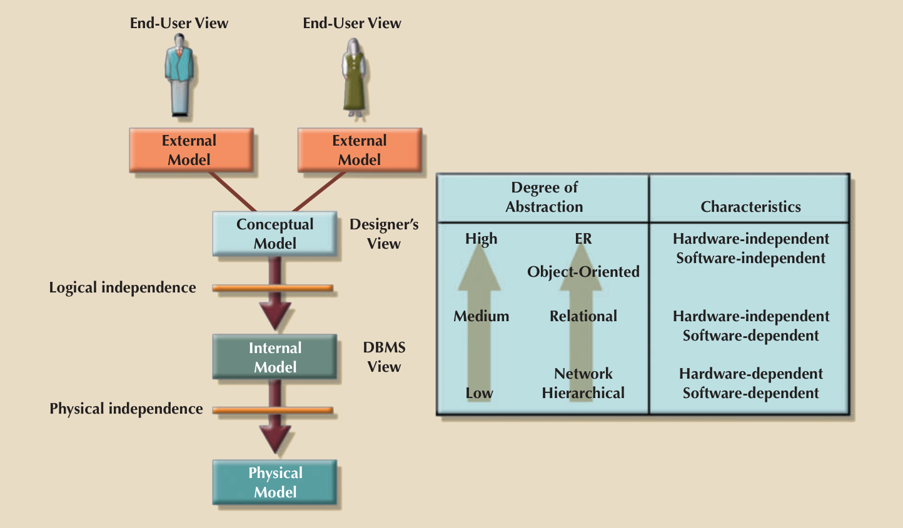
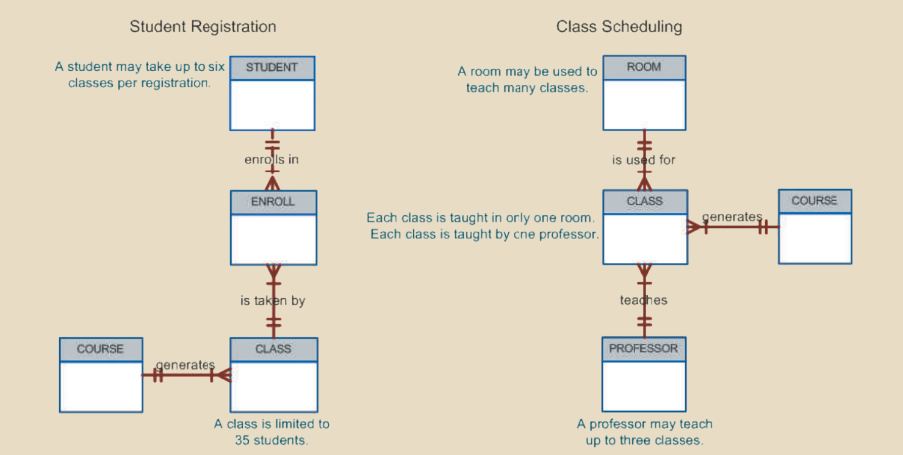
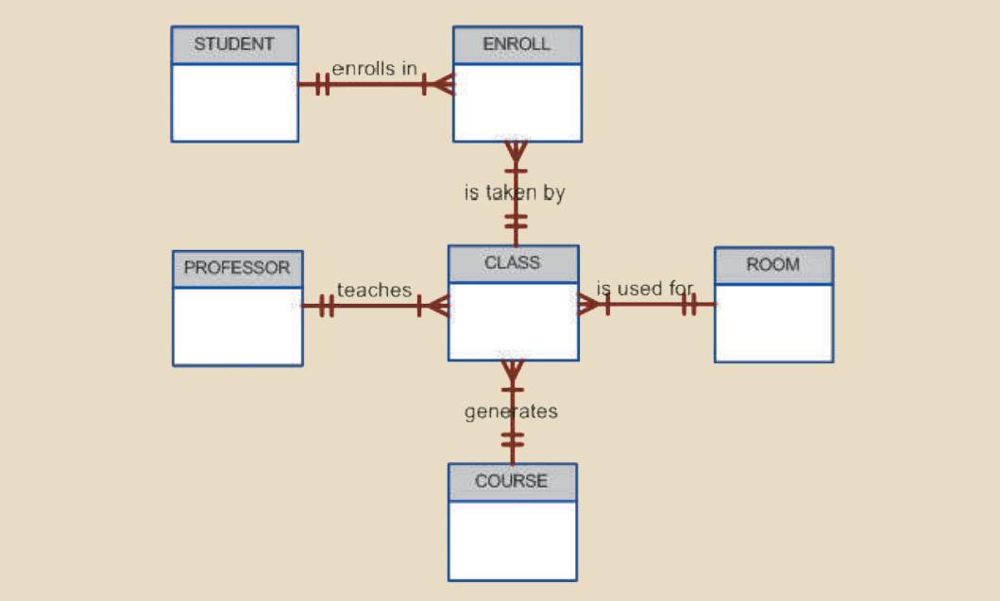
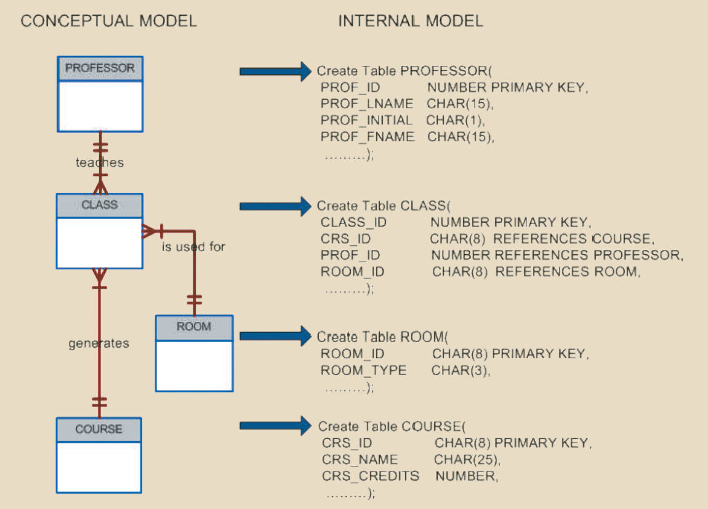
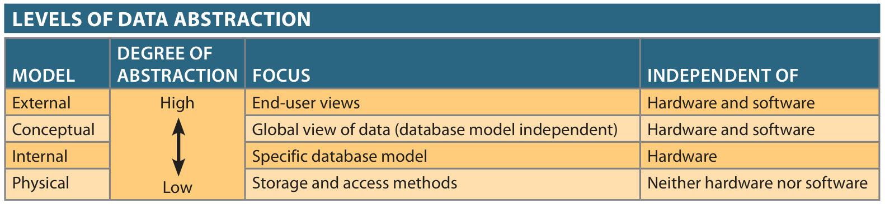

**Table of contents** 
${toc}
# Introduction
In the previous note, we have discussed about why we need database, what is the advantages, and so on. But that is just for the theory, the first step in database design is **data modeling**, it serves as a bridge between real-world objects and the computer database.

One of the most vexing problems of databae design is that designers, programmers and end-users see data in different ways. Consquently, different views of same data can lead to database designs that do not reflect an organization’s actual operation, thus  failing to meet end-user needs and data efficiency requirements.

To avoid such failures,  database designers must obtain a precise description of the data’s nature and many uses  within the organization. Communication among database designers, programmers and end-users should be **frequent** and **clear**.

# Data Modeling and Data Models

| Terminology    | Definition                                                                                                                                |
|----------------|-------------------------------------------------------------------------------------------------------------------------------------------|
| Data modeling  | The process of creating  a specific data model for  a determined problem  domain                                                          |
| Problem domain | A clearly defined area within the real-world environment, with a well-defined  scope and boundaries that will be systematically addressed |
| Data model     | A representation, usually  graphic, of a complex  “real-world” data  structure.                                                           |

So we can see, **data model** is an abstraction of real world object or an event, it helps us to understand the complexities of real-world environment.

Within database environment, a data model represents data structures and  their characteristics, relations, constraints, transformations, and other constructs with  the purpose of supporting a specific problem domain. 

Designing a data model like solving a math question, different people will produce a different model, so the question is which one is correct ? The answer is simple: “the one that meets  all the end-user requirements,” and there may be more than one correct solution!

# The Importance of Data Models
Data models can facilitate interaction among the designer, the applications programmer, and the end user. In other words, data  models are a communication tool. 

As in previous note, data constitutes the most  basic information employed by a system. But it can be viewed differently.

For example, contrast the view of a company manager with that of a company  clerk. Although both work for the same company, the manager is more likely to have an  enterprise-wide view of company data than the clerk. 

We have to keep in mind that **data model is just an abstraction, a blueprint**, but we can't build a good house without a blueprint, and likely we won't create a good database without first creating an approriate data model.

This section in the reference contains a lot of information, but I have summarized it into two main points:
- Data model is an communication tools between designers, programmers and end users.
- Data model is a first step, a blueprint for good database 

# Data Model Basic Building Blocks

The basic building blocks of all data models are:
- Entities
- Attributes
- Relationships
- Constraints 

## Entity
An entity is a person, place, thing or event about which data will be collected and stored.An entity represents a particular type of object in the real world,  which means an entity is “distinguishable”—that is, each entity occurrence is unique and  distinct.

For example, a **CUSTOMER** entity would have many distinguishable customer  occurrences, such as John Smith, Pedro Dinamita, and Tom Strickland.

Sometime entity can be abstract object like flight routes or musical concerts.

## Attributes 
An attribute is a characteristic of an entity.

For example, a **CUSTOMER** entity would be described by attributes such as customer last name, customer first name, customer phone number, the address and customer credit limit.

## Relationships
A relationship describes an association among entities.

For example, a relationship  exists between customers and agents that can be described as follows: an agent can serve  many customers, and each customer may be served by one agent.

Data models use three types of relationships:
- one-to-many
- many-to-many
- one-to-one

### One-to-many (1:M or 1..*) relationship
A painter creates many differet paintings but each painting is created by one painter. Thus, the painter (the “one”) is related to the  paintings (the “many”). Therefore, database designers label the relationship “**PAINTER**  paints **PAINTING**” as **1:M**.

### Many-to-many (M:N or \*..\*) relationship
An employee may learn many job skills,  and each job skill may be learned by many employees. Database designers label the  relationship “**EMPLOYEE** learns **SKILL**” as **M:N**. 

Similarly, a student can take many  classes and each class can be taken by many students, thus yielding the **M:N** label for  the relationship expressed by “**STUDENT** takes **CLASS**.” 

### One-to-one (1:1 or 1..1) relationship
A retail company’s management structure  may require that each of its stores be managed by a single employee. In turn, each  store manager, who is an employee, manages only a single store. Therefore, the relationship “**EMPLOYEE** manages **STORE**” is labeled **1:1**.

## Constraints
A constraint is a restriction placed on the data. Constraints are important because  they help to ensure data integrity. Constraints are normally expressed in the form of  rules:
- An employee’s salary must have values that are between 6,000 and 350,000. 
- A student’s GPA must be between 0.00 and 4.00. 
- Each class must have one and only one teacher. 

Now we have know all the building blocks of data model, how do we properly identify entities, attributes, relationships, and constraints? The first step is to clearly identify **the business rules** for the problem domain you are  modeling. 

# Business Rules

When database designers go about selecting or determining the entities, attributes,  and relationships that will be used to build a data model, they might start by gaining  a thorough understanding of what types of data exist in an organization, how the data  is used, and in what time frames it is used.

But such data and information do not, by  themselves, yield the required understanding of the total business. From a database  point of view, the collection of data becomes meaningful only when it reflects properly  defined business rules.

| Terminology   | Definition                                                                                                          |
|---------------|---------------------------------------------------------------------------------------------------------------------|
| Business rule | A brief, precise, and unambiguous description  of a policy, procedure, or principle within a specific organization. |

Business rules derived from a detailed description of an organization’s operations  help to create and enforce actions within that organization’s environment. Business rules  must be rendered in writing and updated to reflect any change in the organization’s  operational environment.

To be effective, business rules must be easy to understand and widely disseminated to  ensure that every person in the organization shares a common interpretation of the rules. Let's have an example:

- A customer may generate many invoices 
- An invoice is generated by only one customer 
- A training session cannot be scheduled for fewer than 10 employees or for more than  30 employees. 

Note that those business rules establish entities, relationships, and constraints. For  example, the first two business rules establish two entities (**CUSTOMER** and **INVOICE**)  and a **1:M relationship** between those two entities. The third business rule establishes  a constraint (no fewer than 10 people and no more than 30 people) and two entities  (**EMPLOYEE** and **TRAINING**), and also implies a relationship between **EMPLOYEE** and **TRAINING**. 

## Discovering Business Rules 
The key idea is about communication between different components of a business from managers, policy makers to department managers, staff,...

But there will be different views from differnt users, that is the responsibility of the database designers to solve that problem to create a good data model.

## Translating Business Rules into Data Model  Components 
As a general rule, a noun in a business rule will translate  into an entity in the model, and a verb (active or passive) that associates the nouns  will translate into a relationship among the entities.

For example, the business rule “a customer may generate many invoices” contains two nouns (customer and invoices) and a verb (generate) that associates the nouns. From this business rule, you could deduce the following:

- *Customer* and *invoice* are objects of interest for the environment and should be represented by their respective entities. 
- There is a generate relationship between customer and invoice. 

To properly identify the type of relationship, we should consider that relationships  are bidirectional; that is, they go both ways.

For example, the business rule “a customer  may generate many invoices” is complemented by the business rule “an invoice is  generated by only one customer.” In that case, the relationship is one-to-many (1:M).  Customer is the “1” side, and invoice is the “many” side. 

To properly identify a relationship, we should generally ask two questions:
- How many instances of B are related to one instance of A? 
- How many instances of A are related to one instance of B? 

## Naming Conventions
Entity names should be descriptive of the objects in the business environment and  use terminology that is familiar to the users. An attribute name should also be descriptive of the data represented by that attribute. It is also a good practice to prefix the  name of an attribute with the name or abbreviation of the entity in which it occurs.  

For example, in the CUSTOMER entity, the customer’s credit limit may be called **CUS_CREDIT_LIMIT**. The **CUS** indicates that the attribute is descriptive of the **CUSTOMER** entity, while **CREDIT_LIMIT** makes it easy to recognize the data that will  be contained in the attribute.

# Other sections 
At this moment, you will see the name of each section is followed by the content of reference books. For this chapter, there are still two more sections, they talk about evolution of data models and the degree of data abstraction. All information in the textbook is written thoroughly, you can have a look at it.

These notes are just mainly focus ons the design of relational database, the content for big data and noSQL are saved for another notes in the future.

# Data Abstraction Levels 
> In my opinion, this topic is crucial and should be noted!

In the early 1970s, the American National Standards Institue (ANSI) Standards  Planning and Requirements Committee (SPARC) defined a framework for data modeling based on degrees of data abstraction.).

The resulting ANSI/SPARC architecture  defines three levels of data abstraction:
- external 
- conceptual
- intenal

We can use this framework to better understand database models.

## The External Model 
The external model is the end users’ view of the data environment. The term end users refers to people who use the application program to manipulate the data and generate information.

Because data is being modeled, Entity Relationship (ER) diagrams will be used to represent the external  views. A specific representation of an external view is known as an external schema.  

To illustrate the external model's view, examine the data environment of a college.

The figure presents the external schemas for two Tiny College business units: student  registration and class scheduling. Each external schema includes the appropriate entities, relationships, processes, and constraints imposed by the business unit. Also note  that although the application views are isolated from each other, each view shares a common entity with the other view. For example, the registration and scheduling external  schemas share the entities **CLASS** and **COURSE**.

From these two external models, there are a lot of thing can be derived, you can have a look at **page 58 of the reference**, to see these derived information. 

But what advantages does the external model gives ? 

- It is easy to identify specific data required to support each business unit’s operations. 

- It makes the designer’s job easy by providing feedback about the model’s adequacy.  Specifically, the model can be checked to ensure that it supports all processes as defined  by their external models, as well as all operational requirements and constraints. 

- It helps to ensure security constraints in the database design. Damaging an entire  database is more difficult when each business unit works with only a subset of data. 

- It makes application program development much simpler. 

## The Conceptual Model 
The conceptual model represents a global view of the entire database by the entire  organization. That is, the conceptual model integrates all external views (entities,  relationships, constraints, and processes) into a single global view of the data in the  enterprise, as shown in folloiwng figure. Also known as **conceptual schema**, it is the basis  for the identification and high-level description of the main data objects **(avoiding any  database model-specific details)**.  

The most widely used conceptual model is the ER model. Remember that the ER  model is illustrated with the help of the ERD, which is effectively the basic database  blueprint. The ERD is used to graphically represent the conceptual schema.

So what are the advantages of this model ? 
- First, it provides a bird’seye (macro level) view of the data environment that is relatively easy to understand.
- Second, the conceptual model is independent of both software and hardware.  

Welp, let's explain those two term 

| Terminology          | Definition                                                                         |
|----------------------|------------------------------------------------------------------------------------|
| Software Independent | The model does not depend on the DBMS  software  used to implement the model       |
| Hardware Independent | The model does not  depend on the hardware used in the implementation of the model |

Therefore, the model does not  depend on the hardware used in the implementation of the model. Therefore, changes  in either the hardware or the DBMS software will have no effect on the database design  at the conceptual level. Generally, the term **logical design refers to the task of creating a  conceptual data model** that could be implemented in any DBMS. 

## The Internal Model
Once a specific DBMS has been selected, the internal model maps the conceptual model  to the DBMS. The internal model is the representation of the database as “seen” by the  DBMS. In other words, the internal model requires the designer to match the conceptual  model’s characteristics and constraints to those of the selected implementation model.

An internal schema depicts a specific representation of an internal model, using the  database constructs supported by the chosen database.

 

Since the internal model depends on specific database software, it is said to be  software dependent. Therefore, a change in the DBMS software requires that the internal model be changed to fit the characteristics and requirements of the implementation  database model. 

However, chaning the internal model won't affect the conceptual model, this is when we have **logical independence**. The internal model is still  hardware independent because it is unaffected by the type of computer on which the  software is installed. Therefore, a change in storage devices or even a change in operating systems will not affect the internal model. 

## The Physical Model
The physical model operates at the lowest level of abstraction, describing the way data  is saved on storage media such as magnetic, solid state, or optical media.

At this level, we will have **physical independence** since changing the physical model won't affect the **internal model**. 

## Summary 
  

View more about this Three Level of Abstraction at:
- [Three Level of Abstraction from Gate Smasher](https://www.youtube.com/watch?v=5fs1ldO6B5c) 
