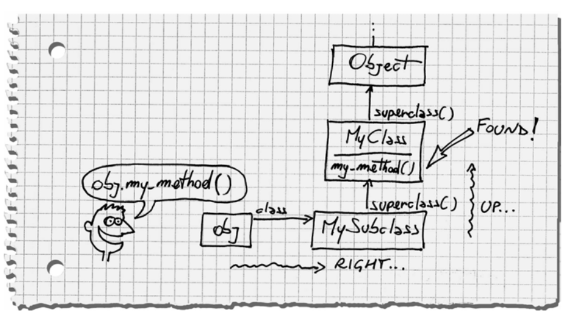

**Table of contents** 
${toc}

# What happen when we call a method ?
When we call a method, Ruby does two things:
1. It finds the method, this is a process called **method lookup** 
2. It executes the method. To do that, Ruby needs something called **self** 

## Method lookup
This process, finding a method and execute it, happens in every object-oriented language. In a dynamic language like Ruby, however, it's particularly important that we understand this process!

If you remember, in the `object-mode.md`, we have talk about how an object can find its **instance method**. But that's is just a simple example, to look at more complicate example, we need to know two new concepts:
- receiver: simply the object that the method was called on 

For example, `my_string.reverse`, then `my_string` is the receiver

- ancestors chain: the path we go from the current class upto their ancestors (`Object`, `BasicObject`)

Alright, so now here is what happen for the method lookup process, just one sentece. **Ruby goes in the receiver's class, and from there it climbs the ancestors chain until it finds the method**.

Alright, let's have a look at an example!

```ruby 
class MyClass
    def my_method; 'my_method()'; end
end

class MySubclass < MyClass
end

obj = MySubclass.new 
puts obj.my_method
```

*Results:* `my_method()`

Here is what happen in diagram:

 

Fun fact, we don't even need to draw the ancestors chain, Ruby can do that for us!

```ruby
class MyClass
    def my_method; 'my_method()'; end
end

class MySubclass < MyClass
end
p MySubclass.ancestors
```

*Results:* `[MySubclass, MyClass, Object, Kernel, BasicObject]`

Interestingly, `Kernel` is not a class but instead a `Module`, why we have it in the ancestors chain ?

```ruby
module M 
    def my_method
        'M#my_method()'
    end
end

class C 
    include M 
end

class D < C; end 

puts D.new.my_method
p D.ancestors
```

*Results:*
```
M#my_method()
[D, C, M, Object, Kernel, BasicObject]
```

When we include a module in a class (or even in another module), Ruby plays a little trick. It creates an anonymous class that wraps the module and inserts the anonymous class in the chain, just above the including class itself.

These "wrapper" classes are called *include classes* (sometimes called *proxy classes*). Include classes are a well-kept secret of Ruby. The `superclass()` method pretends that they don't even exist, and in general we can't access them from regular Ruby code!

## Kernel
Ruby includes some methods, such as `print()`, that you can call from anywhere in your code. It looks like each and every object has the `print()` method. methods such as `print()` are actually private instance methods of module `Kernel`:

```ruby
p Kernel.private_instance_methods.grep(/^pr/)
```

*Results:* `[:proc, :printf, :print]`

The trick here is that class `Object` includes `Kernel`, so `Kernel` gets into every object's ancestors chain. and since we're always sitting inside an object, you can call the `Kernel` methods from anywhere. 

This gives us an illusion that `print` is a language keyword but instead it's actually a **method**! 

We could take advantage of this mechanism, if we add a method to `Kernel`, this `Kernel` method will be available to all projects!

> Kernel Method spell

## Method Execution

First part is find the method, second part is execute it. So let's have a look at a code snippet.

```ruby
def my_method 
    temp = @x + 1 
    my_other_method(temp)
end
```

Ah ha, to execute this method, there is two question to be answered:
1. What object does the instance variables `@x` belong to ?
2. What object should call `my_other_method()` ?

It's simple, all of that belong to the receiver - the object that `my_method()` was orginally called upon. However, Ruby need a reference to the receiver, so it can remember who it is as it executes the method.

That's reference is **self**.

### Discovering self 
Every line of Ruby code is executed inside an object—the so–called current object. The current object is also known as self , because we can access it with the self keyword.

Only one object can take the role of **self** at a given time, but no object holds that role for a long time.

In particular, when we call a method, the receiver becomes **self**. From that moment on, all instance variables are instance variables of the receiver are called on **self**.

As soon as the code explicitly calls a method on some other object, that another object becomes self.

Example:

```ruby
class MyClass
    def testing_self 
        @var = 10
        my_method()
        self
    end

    def my_method
        @var += 1
    end
end
obj = MyClass.new 
p obj.testing_self
```

*Results:* `#<MyClass:0x0000563df958ba28 @var=11>`

To become a master of Ruby, the book said not me, we should always know which object has the role **self** at any given moment.

### The top level 
Object will become **self** when we call a method on an object, but hey, who's **self** if we haven't called any method yet ?

```ruby
puts self 
puts self.class
```

*Results:*
```
main
Object
```
As soon as you start a Ruby program, you’re sitting within an
object named main that the Ruby interpreter created for you.
This object is sometimes called the top-level context, because
it’s the object you’re in when you’re at the top level of the call
stack: either you haven’t called any method yet or all the methods that you called have returned.

### Class definition and self
Usually the role of **self** is taken by the last object who received a method call. However, in a class or module definition, the role of **self** is taken by the class or module! 

### What `private` really means ?
Private methods are governed by a single simple rule, we can't call a private method with an **explicit**  receiver. In other words, every time you call a private method, it must be the implicit receiver - **self**.
```ruby
class C 
    def public_method
        self.private_method
    end

    private 

    def private_method; end
end

puts C.new.public_method
```

> I don't really understand this on page 46, re-read later!

*Results:* ``

## Quiz: Tangle of Modules
```ruby
module Printable
    def print
        puts "Printable#print"
    end

    def prepare_cover
        puts "Printable#prepare_cover"
    end
end

module Document
    def print_to_screen
        puts "Document#print_to_screen"
        prepare_cover
        format_for_screen
        print
    end

    def format_for_screen
        puts "Document#format_for_screen"
    end

    def print
        puts "Document#print"
    end
end

class Book
    include Document
    include Printable

    # Solution 
    # include Printable
    # include Document
end

b = Book.new 
b.print_to_screen
```

*Results:*
```
Document#print_to_screen
Printable#prepare_cover
Document#format_for_screen
Document#print
```

Questions: 
- `print_to_screen()` is not calling the right `print()` method, can you guess which version of `print()` gets called - the one in `Printable` or in `Document` ? 
> Printable one will be called!

- Try drawing the chain of ancestors on paper.
> Book, Printable, Document, Object, Kernel, BasicObject

- How to fix the code quickly and call the other version or `print()` instead ?
> Swap two include statements

## Summing up 
- An object is composed of a bunch of instance variables and a link to a class 

- The methods of an object live in the object's class 

- The class itself is just an object of class `Class`, name of class is just a **constant** 
- `Class` is a subclass of Module . A module is basically a package of methods. In addition to that, a class can also be instantiated (with `new()`) or arranged in a hierarchy (through its `superclass()`).
- Constants are arranged in a tree similar to a file system, where
the names of modules and classes play the part of directories and
regular constants play the part of files.
- Each class has an ancestors chain, beginning with the class itself
and going up to `BasicObject`
- When you call a method, Ruby goes right into the class of the
receiver and then up the ancestors chain, until it either finds the
method or reaches the end of the chain
- Every time a class includes a module, the module is inserted in
the ancestors chain **right above the class itself**
- When you call a method, the receiver takes the role of testing_self
- When you’re defining a module (or a class), the module takes the
role of self
- Instance variables are always assumed to be instance variables of
self
- Any method called without an explicit receiver is assumed to be a
method of self 
