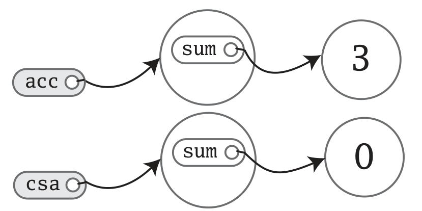

**Table of contents** 
${toc}

# Classes and Objects
## Classes, fields, and methods 

A class is a blueprint for objects (such a well-known statement). We can create objects from the class blueprint with the keyword `new`

```scala
class CheckSumAccumulator:
  var sum = 0
// create CheckSumAccumulator object 
val acc = new CheckSumAccumulator
val csa = new CheckSumAccumulator
```
Here is the image of the objects in memory:
 

Then we modify the sum variable of `acc`:

```scala
acc.sum = 3
```

Now the picture would look like this:

 

Fields are also known as **instance variable**, changing value of one won't affect the others! (Meh this is like basic OOP knowledge).

However, we shouldn't let other parts of the program have the ability to access these fields! We will declare them with `private`

> Default access level in Scala is public

Let's make `sum` private and add some more methods to it.

```scala
class ChecksumAccumulator:
  private var sum = 0

  def add(b: Byte): Unit =
    sum += b

  def checksum(): Int =
    return ~(sum & 0xFF) + 1
```

One interesting thing worth noticing here is, in `add` method, we can't modify the value of parameter `b`, because in Scala, by default, 
parameter is a `val` not a `var`!

## Rules of semicolon inference
It is very simple:
1. The line in question ends in a word that would not be legal as the end of a statement 
2. The next line begins with a word that cannot start a statement
3. The line ends while inside parantheses (...) or brackets [...], because these cannot contain multiple statements anyway

## Singleton Objects
Scala's classes can't have static members, but instead it has **singleton objects**. A singleton object definition looks like 
a class definition in Scala, except instead of the keyword `class`, we use `object`.

When a singleton object share the same name with a class, it is called the class's **companion object**. We must define both 
the class and its companion object in the same source file. The class is the **companion class** of the singleton object. 
A class and its companion object can access each other's private members.

A singleton object is a first-class object, we can think of a single object's name, therefore, as a "name tag" attached to the object.
Defining a single object doesn't define a type! However, singleton objects extend a superclass and can mix in traits. Given each singleton 
objects is an instance of its superclassess and mixed-in traits, we can invoke its methods via these types, refer to it from variables of these types, 
and pass it to methods expecting these types.

One difference between classes and singleton objects it that single objects can't take parameters, whereas classes can. Simply because we can't instatiate
a single object with the `new` keyword, so we have no way to pass parameters to it.

Each singleton object is implemented as an instance of a synthetic class referenced from a static variable, so they have the same initialization semantics as 
Java statics. In particular, a singleton object is initialized the first time some code accesses it. 

A singleton object that doesn't share the same name with a companion class is called a **standalone object**.
