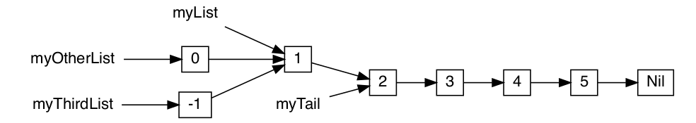

**Table of contents** 
${toc}

# Collections in Scala
## Operations
Scala collections provide many common operations for constructing them, querying them, or transforming them.
### Builders
Builders let us efficiently construct a collection of unknown length, "freezing" it into the collection we want at the end

```scala
val b = Array.newBuilder[Int]
b += 1 
b += 2
b.result()
```

Let's play with it at `scripts/collections/builder.scala`

### Factory Methods
Factory methods are simply methods provided by collection classes that offer alternative ways to instantiate and create collections. These methods provide convenient ways to create collections with specific characteristics or based on certain patterns.

```scala
val a = Array.fill(5)("Hello")

val b = Array.tabulate(5)(n => s"hello $n")

val c = Array(1,2,3) ++ Array(4,5,6)
```

### Transforms
Transforms take an existing collection and create a new collection modified in some way. 

**Note that these transformations create copies of the collection, and leave the original unchanged**. That means if we are still
using the original array, its contents will not be modified by the transform.

Here are several examples:

```scala
Array(1,2,3,4,5,6).map(i => i*2)

Array(1,2,3,4,5,6).filter(i => i % 2 == 1)

Array(1,2,3,4,5,6).take(2)

Array(1,2,3,4,5,6).drop(2)
```

### Queries
Queries let you search for elements without your collection, returning either a Boolean indicating if a
matching element exists, or an `Option` containing the element that was found. Some examples are:
- `find` 
- `exists`

### Aggregations
#### mkString
Stringifies the elements in a collection and combines them into one long string, with the given separator.
Optionally can take a start and end delimiter:

```scala
Array(1,2,3,4,5,6).mkString(",")
Array(1,2,3,4,5,6).mkString("[", ",", "]")
```
#### foldLeft and foldRight
> At the momement writing this note, i still confuse about the differences and usage of this function 18/07/2023
#### groupBy
Groups our collection into a Map of smaller collections depending on a key:

```scala
val grouped = Array(1,2,3,4,5,6,7).groupBy(_ % 2)
// Try running this inside REPL
```
#### Converters
We can convert among `Arrays` and other collection like `Vector` and `Set` using the `to` method 

```scala
Array(1,2,3).to(Vector)

Vector(1,2,3).to(Array)

Array(1,1,2,2,3,4).to(Set)
```

#### Views
When we chain multiple transformations on a collection, we are creating many intermediate collections that are immediately thrown away.

```scala
val myArray = Array(1,2,3,5,6,7,8,9)
val myNewArray = myArray.map(x => x +1).filter (x => x%2 ==0).slice(1,3)
```
 

This chain create new immediate collections but only the last collection ends up being stored in `myNewArray`. This creation and traversal of intermediate collections is wasteful, we can use `.view` together with `.to` to "fuse" the operations together.

```scala
val myNewArray = myArray.view.map(_ + 1).filter(_ % 2 == 0).slice(1, 3).to(Array)
```
 

## Immutable Collections
Immutable collections rule out an entire class of bugs due to unexpected modifications, and are especially
useful in multi-threaded scenarios where we can safely pass immutable collections between threads
without worrying about thread-safety issues.

Most immutable collections use **Structural Sharing** to make **creating updated copies cheap**, allowing us to use them in all but the most performance critical code. 
### Immutable Vectors
`Vector`s are fixed-size, immutable linear sequences. They are a good general-purpose sequence data
structure, and provide efficient **O(log n)** performance for most operations.

```scala
val v = Vector(1,2,3,4,5)

val v2 = v.updated(2,10)
```
Unlike `Array`s where `a(...)=...` mutates it in place, a `Vector`'s `updated` method returns a new `Vector` with the modification while leaving the old one unchanged.

Similarly, using `:+` and `+:` to create a new Vector with additional 
elements on either side, or using . tail to create a new Vector with one element removed, are all O(log n) as well

### Structural Sharing
`Vector`s implement their O(log n) copy-and-update operations by re-using portions of their tree structure.
This avoids copying the whole tree, resulting in a "new" Vector that shares much of the old tree structure with only minor modifications.

Consider a large `Vector`, `v1`:

```scala
val v1 = Vector(1, 2, 0, 9, 7, 2, 9, 6, .... )
```

This is represented in-memory as a tree structure, whose breadth and depth depend on the size of the `Vector`:

 

Let us consider what happens if we want to perform an update, e.g. replacing the fifth value
`Vector` with the value `8` :

```scala
val v2 = v1.updated(4, 8)
```
This is done by making updated copies of the nodes in the tree that are in the direct path down to the value
we wish to update, but re-using all other nodes unchanged:
 

This structural sharing is what allows updated copies of the Vector to be created in only O(log
n) time. This is much less than the O(n) time it takes to make a full copy of a mutable Array or other data
structure.

However, updating a Vector does always involve a certain amount of copying, and will never be as fast
as updating mutable data structures in-place. In some cases where performance is important and you are
updating a collection very frequently, you might consider using a mutable `ArrayDeque`, which has
faster O(1) update/append/prepend operations, or raw `Array`s if you know the size of your collection in
advance.

### Immutable Sets
Scala's immutable Set s are unordered collections of elements without duplicates, and provide an efficient
O(log n) . contains method. Set s can be constructed via + and elements removed by - , or combined via
++ . Note that duplicates elements are discarded:

```scala
val s = Set(1,2,3)
s.contains(2)
Set(1,2,3) + 4 + 5 
Set(1,2,3) - 2
Set(1,2,3) ++ Set(1,4,5)
```
There are several things to care about:
- The uniqueness of items within a Set is also sometimes useful when you want to ensure that a collection
does not contain any duplicates.
- We can iterate over `Set`s using for-loops, but the order of items is undefined and should not be relied upon
### Immutable Maps
Immutable maps are unordered collections of keys and values, allowing efficient lookup by key:

We can use two methods to check if Map contains a key 
- `contains`
- `get`: If we are not sure whether a map contains a key or not

While `Map`s support the same set of operations as other collections, they are treated as collections of tuples
representing each key-value pair. Conversions via `.to` requires a collection of tuples to convert from, `+` adds 
tuples to `Map` as key-value pairs, and `for` loop iterate over tuples

```scala
Vector(("one", 1), ("two", 2), ("three", 3)).to(Map)
res62: Map[String, Int] = Map("one" -> 1, "two" -> 2, "three" -> 3)

Map[String, Int]() + ("one" -> 1) + ("three" -> 3)
res63: Map[String, Int] = Map("one" -> 1, "three" -> 3)

for ((k, v) <- m) println(k + " " + v)
one 1
two 2
three 3
```

### Immutable Lists
Scala's immutable List s are a singly-linked list data structure. Each node in the list has a value and pointer
to the next node, terminating in a `Nil` node.

`List`s have:
- `.head`[*O(1)*]: look up the first item in the list 
- `.tail`[*O(1)*]: create a list without the first element 
- `::`[*O(1)*]: create a new `List` with one more element in front.

```scala
@ val myList = List(1, 2, 3, 4, 5)
myList: List[Int] = List(1, 2, 3, 4, 5)

@ myList.head
res66: Int = 1

@ val myTail = myList.tail
myTail: List[Int] = List(2, 3, 4, 5)

@ val myOtherList = 0 :: myList
myOtherList: List[Int] = List(0, 1, 2, 3, 4, 5)

@ val myThirdList = -1 :: myList
myThirdList: List[Int] = List(-1, 1, 2, 3, 4, 5)
```
Interestingly, `.tail` and `::` are efficient because they can share much of the existing `List:.tail` returns a reference to
the next node in the singly linked structure, while `::` adds a new node in front. The fact that multiple lists
can share nodes means that in the above example, `myList` , `myTail` , `myOtherList` and `myThirdList` are
actually mostly the same data structure:

 

Downside of link lists lies in the search operation is a slow operation with *O(n)*.

# Additional Information
## Parameterize arrays with types
> Parameterization means 'configuring' an instance when we create it. 

In other words, we parameterize an instance with values by passing objects to a constructor in parentheses.

```scala 
val greetStrings = new Array[String](3)
// Or more specific
val greetStrings: Array[String] = new Array[String](3)
```

The type of `greetStrings` is `Array[String]` not `Array[String](3)`. Like Javascript `const`, defining a variable with `val`,
the variable can't be reassigned but the object to which it refers could potentially still be changed.

Let's try to print all elements in the array:

```scala
for i <- 0 to 2 do 
  print(greetStrings(i))
```

The first line of code in this for expression illustrates another general rule of Scala, if a method takes only one parameter, we can call it 
without a dot or parentheses. The `to` in this example is actually a method that takes one Int argument. The code `0 to 2` is transformed into the method call `0.to(2)`. Not that this syntax only works if we specify the receiver of the method call.

Scala doesn't technically have operator overloading, because it doesn't actually have operators in the traditional sense. Instead, characters
such as +,-,* and / can be used in method names. Thus, when we type `1+2`, it will be transform into `1.+(2)`

Another important idea illustrated by this example will give us insight into why arrays are accessed with parentheses in Scala. Arrays are simply instances of classes like any other class in Scala. When you apply parentheses surrounding zero, one, or more values to a variable, Scala will transform the code into an invocation of a method named apply on that variable. So greetStrings(i) gets transformed into greetStrings.apply(i) . Thus accessing an element of an array in Scala is simply a method call like any other.

This principle is not restricted to arrays: any application of an object to some arguments in parentheses will be transformed to an `apply`
method call. Of course, this will compile only if that type of object actually defines an `apply` method. So it's not a special case but Instead a general rule.

Similarly, when an assignment is made to a variable to which parentheses and one or more arguments have been applied, the compiler will transform
that into an invocation of an update method that takes the arguments in parentheses as well as the object to the right of the equals sign.

```scala
greetStrings(0) = "Hello"

// equivalent to 
greetStrings.update(0, "Hello")
```

However, Scala provides a more concise way to create and initialize arrays.

```scala
val numNames = Array("zero", "one", "two")
```

What we are actually doing is calling a **factory method** , named apply, which creates and returns the new array. This `apply` method 
takes a variables number of arguments and is defined on the Array *companion object*.


